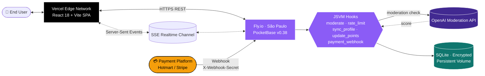

<!-- markdownlint-disable MD033 MD041 -->
<div align="center">

# Imigrar Espanha — Community Hub & Sales Platform

**An AI-Native, Source-Available platform for the Brazilian community immigrating to Spain.**

[](./LICENSE)
[](https://imigrar-espanha-site-web.vercel.app)
[](https://imigrar-espanha-pb.fly.dev/api/health)
[](https://pocketbase.io)
[](https://platform.openai.com/docs/guides/moderation)
[](https://react.dev)
[](https://tailwindcss.com)
[](#-the-real-story--ai-native-development)

[🌐 Live Site](https://imigrar-espanha-site-web.vercel.app) · [🔌 API Health](https://imigrar-espanha-pb.fly.dev/api/health) · [💬 Community](https://imigrar-espanha-site-web.vercel.app/comunidade) · [🇧🇷 Versão em Português](#-versão-em-português-quick-mirror)

</div>

---

## Table of contents

- [The real story — AI-Native development](#-the-real-story--ai-native-development)
- [What this platform delivers](#-what-this-platform-delivers)
- [System architecture](#%EF%B8%8F-system-architecture)
- [Tech stack](#-tech-stack)
- [Repository layout](#-repository-layout)
- [Quick start — local development](#-quick-start--local-development)
- [Deploying to production](#-deploying-to-production)
- [Environment variables](#-environment-variables)
- [API & integration surface](#-api--integration-surface)
- [Support & donations](#-support--donations)
- [Versão em Português (Quick Mirror)](#-versão-em-português-quick-mirror)
- [License — Source-Available](#-license--source-available)

---

## 🤖 The real story — AI-Native development

This project is **built by [Gabriel Alves Izaias](https://github.com/gabriel-alves051294)** — IT Technician, prompt-engineering enthusiast, and AI practitioner — preparing his long-term move from Brazil to Spain. The platform doubles as the public hub of his immigration infoproduct and as a working case study on what a single technical operator can ship when paired with modern generative AI.

**~80% of this ecosystem** — including the PocketBase JSVM hooks, the OpenAI moderation pipeline, the Fly.io / Vercel deploy choreography, the gamification rank engine, and most of the React components — **was authored, refined, and orchestrated through strategic, iterative collaboration with AI agents**. The remaining ~20% is human-driven product strategy, technical direction, bug triage, security hardening, and the editorial voice of the sales narrative.

The result is a transparent demonstration that **deep IT fundamentals + disciplined prompt engineering ≠ "vibe coding"**. It produces resilient, observable, production-grade systems in a fraction of the historical time-to-market — and this repository keeps the receipts.

---

## ✨ What this platform delivers

### Sales & marketing surface
- High-conversion landing page for the Spanish-immigration infoproduct
- Affiliate program portal with conversion-tracking copy
- SEO-ready public blog with Rich Text Editor for long-form articles

### Community hub
- **Real-time chat rooms** moderated by OpenAI Moderation (toxicity, harassment, self-harm, sexual content blocked **before** persistence) with a 6-hour visual TTL for a clean look
- **Threaded forum** segmented by immigration topics (NIE, TIE, FP — Formación Profesional, housing, work, day-to-day life) with realtime reply notifications
- **Personal blog space** where authenticated members publish their own articles using the integrated Rich Text Editor

### Gamification — the COMIQUICE rank system
Five satirical immigration-themed tiers driven by an **atomic SQL increment** (`UPDATE points = points + N`) so concurrent writes never lose updates:

| Tier | Range | Visual identity |
|---|---|---|
| 🛬 **Imigrante sem Papel** | 0 – 50 pts | Faded avatar, dashed gray badge |
| 🇪🇸 **Turista Estourado** | 51 – 200 pts | Solid amber badge |
| 🎓 **Estudante de Intercâmbio** | 201 – 600 pts | Emerald-bordered avatar, blue-teal gradient badge |
| 📂 **Residente com Arraigo** | 601 – 1500 pts | Pulsing avatar, purple-indigo gradient badge with neon shadow |
| 👑 **Cidadão Europeu** | 1500+ pts **or** verified customer | Animated gold/red shimmer aura, profile renders as a Biometric European Passport |

Earning rules: chat msg **+1** · blog comment **+2** · forum reply **+3** · new forum topic **+5** · blog article **+10** · membership tenure **+10 / month** (computed client-side, never persisted).

### Trust & safety
- FAIL-CLOSED OpenAI moderation hook with environment kill-switch (`MODERATION_ENABLED=false`)
- Server-side rate limiting per author per collection
- Granular soft-ban (`is_banned`) blocks new interactions without deleting the account
- Custom payment webhook (`POST /api/webhooks/payment`) authenticated by header `X-Webhook-Secret` for Hotmart/Stripe-style integrations

---

## 🏗️ System architecture



**Why this shape?** PocketBase gives us a single Go binary that bundles REST, realtime SSE, file storage, migrations, an admin UI, and a JSVM hook layer — everything the community needs without a microservice zoo. The React SPA on Vercel handles UI, while every business rule lives server-side as inline JSVM handlers (PB v0.38 isolates callbacks, so each handler is **fully self-contained** — no top-level helpers, no closure surprises).

---

## 🧱 Tech stack

| Layer | Choice | Why |
|---|---|---|
| Frontend framework | **React 18 + Vite** | Fast HMR, modern JSX, mature ecosystem |
| UI primitives | **TailwindCSS + shadcn/ui** | Utility-first styling + accessible Radix primitives |
| Router | **React Router 6** | Nested routes, data APIs |
| Backend | **PocketBase v0.38** | Single binary, JSVM hooks, SSE realtime, SQLite |
| Auth | **OAuth2 (Google)** | Zero-friction social login |
| Moderation | **OpenAI Moderation** | Industry-standard toxicity / harm classification |
| Backend hosting | **Fly.io** (`gru` region) | São Paulo edge, persistent volumes, simple deploys |
| Frontend hosting | **Vercel** | Global edge, instant rollbacks, GitHub-driven deploys |
| Monorepo | **npm workspaces** | First-class, zero dependencies |
| CI/CD | **flyctl + Vercel GitHub integration** | Push-to-deploy on both sides |

---

## 📁 Repository layout

```
.
├── apps/
│   ├── pocketbase/
│   │   ├── pb_hooks/                  # JSVM hooks — every handler 100% inline
│   │   │   ├── moderate.pb.js              # OpenAI Moderation pipeline
│   │   │   ├── rate_limit.pb.js            # Per-author throttling
│   │   │   ├── sync_profile.pb.js          # users → profiles mirror (fail-loud)
│   │   │   ├── update_points.pb.js         # Atomic SQL increment (gamification)
│   │   │   ├── payment_webhook.pb.js       # POST /api/webhooks/payment
│   │   │   └── update_thread_stats.pb.js   # Forum reply counters
│   │   └── pb_migrations/             # Versioned schema (profiles, posts, blog, chat…)
│   └── web/                           # React + Vite frontend
│       ├── src/
│       │   ├── components/                 # RankBadge, RankedAvatar, ChatInput, etc.
│       │   ├── pages/                      # HomePage, ChatRoom, ForumPage, ProfilePage…
│       │   ├── lib/                        # pocketbase.js, rank.js, moderation.js
│       │   └── contexts/                   # AuthContext
│       └── vercel.json
├── workers/
│   └── nsfw-moderation/               # Cloudflare Worker for visual moderation
├── .github/                           # Community health files (CoC, CONTRIBUTING, SECURITY…)
├── Dockerfile                         # PocketBase v0.38 on alpine
├── fly.toml                           # Fly.io app config (gru, volume, healthcheck)
├── deploy-hooks.ps1                   # One-shot PowerShell deploy
├── package.json                       # npm workspaces root
└── LICENSE                            # Source-Available Proprietary License
```

---

## 🚀 Quick start — local development

**Prerequisites:** Node 22+, Git, PowerShell (Windows) or bash (macOS/Linux). For deploys: a Fly.io account and `flyctl` installed.

```bash
# 1. Clone & install
git clone https://github.com/gabriel-alves051294/imigrar-espanha-site.git
cd imigrar-espanha-site
npm install --legacy-peer-deps

# 2. Download the PocketBase binary (once)
cd apps/pocketbase
# Linux / macOS:
wget https://github.com/pocketbase/pocketbase/releases/download/v0.38.0/pocketbase_0.38.0_linux_amd64.zip
unzip pocketbase_0.38.0_linux_amd64.zip && chmod +x pocketbase
# Windows: download pocketbase_0.38.0_windows_amd64.zip from the same release page
# and extract pocketbase.exe into apps/pocketbase/

# 3. Configure environment
cp apps/pocketbase/.env.example apps/pocketbase/.env  # if present, otherwise create it
# Edit apps/pocketbase/.env:
#   OPENAI_API_KEY=sk-proj-...
#   PB_ENCRYPTION_KEY=<run: openssl rand -hex 32>
#   MODERATION_ENABLED=true
#   PAYMENT_WEBHOOK_SECRET=<random 32-char string>

# 4. Run both apps in parallel
cd ../..
npm run dev
```

- Frontend: <http://localhost:5173>
- Backend: <http://localhost:8090>
- PocketBase Admin: <http://localhost:8090/_/>

---

## 📦 Deploying to production

### Backend → Fly.io

```powershell
# First-time setup
flyctl auth login
flyctl apps create imigrar-espanha-pb
flyctl volumes create pb_data --size 1 --region gru
flyctl secrets set `
  PB_ENCRYPTION_KEY="$(openssl rand -hex 32)" `
  PB_SUPERUSER_EMAIL="admin@example.com" `
  PB_SUPERUSER_PASSWORD="<strong-password>" `
  OPENAI_API_KEY="sk-proj-..." `
  PAYMENT_WEBHOOK_SECRET="<random-32-chars>" `
  -a imigrar-espanha-pb

# Recurring deploys
.\deploy-hooks.ps1
```

### Frontend → Vercel

Push to `main` and the Vercel GitHub integration takes over. The single env var needed in Vercel is:

```
VITE_POCKETBASE_URL=https://imigrar-espanha-pb.fly.dev
```

---

## 🔐 Environment variables

| Variable | Scope | Purpose |
|---|---|---|
| `OPENAI_API_KEY` | Fly secret | OpenAI Moderation API authentication |
| `MODERATION_ENABLED` | Fly secret | `false` disables moderation hook (e.g. when OpenAI quota is exhausted) |
| `PB_ENCRYPTION_KEY` | Fly secret | At-rest encryption for sensitive PocketBase fields |
| `PB_SUPERUSER_EMAIL` / `PASSWORD` | Fly secret | Bootstrap credentials for the admin UI |
| `PAYMENT_WEBHOOK_SECRET` | Fly secret | Shared secret for `POST /api/webhooks/payment` |
| `RL_CHAT_MAX` | Fly env (opt) | Override chat rate limit (default 60 msgs / 60s) |
| `RL_CHAT_WINDOW` | Fly env (opt) | Override chat rate-limit window in seconds |
| `MOD_STRICT_THRESHOLD` | Fly env (opt) | OpenAI category-score cutoff (default 0.50) |
| `MOD_MAX_STRIKES` | Fly env (opt) | Strikes before automatic ban (default 3) |
| `VITE_POCKETBASE_URL` | Vercel env | Backend URL the SPA points to |

---

## 🔌 API & integration surface

### Standard PocketBase REST
- `POST /api/collections/users/auth-with-oauth2` — Google OAuth login
- `GET /api/collections/users/auth-methods` — list active OAuth providers
- `GET/POST /api/collections/{posts|replies|blog_posts|blog_comments|chat_messages}/records`
- `GET /api/realtime` — Server-Sent Events stream (subscriptions)

### Custom endpoints
- `POST /api/webhooks/payment` — payment platform webhook (requires `X-Webhook-Secret` header)
  - Body: `{"email":"user@example.com","event":"approved|refunded|chargeback"}`
- `GET /api/health` — health probe

---

## ❤️ Support & donations

Running this platform incurs **real recurring costs**: Fly.io compute, persistent volumes, Vercel bandwidth, OpenAI Moderation API requests, and the experimentation cycles that keep the AI-native workflow sharp. Every contribution lets me keep the moderation layer on, the rate limits generous, and the testing pipeline funded.

<table>
<tr>
<th align="left" width="20%">Region</th>
<th align="left" width="35%">Method</th>
<th align="left" width="45%">Details</th>
</tr>
<tr>
<td>🇧🇷 <strong>Brazil</strong></td>
<td>PIX</td>
<td><code>31994960367</code> &nbsp;·&nbsp; <em>Gabriel Alves Izaias</em></td>
</tr>
<tr>
<td>🌍 <strong>International</strong></td>
<td><a href="https://buymeacoffee.com/gabrielalvk">Buy Me a Coffee</a></td>
<td><a href="https://buymeacoffee.com/gabrielalvk">buymeacoffee.com/gabrielalvk</a></td>
</tr>
</table>

---

## 🇧🇷 Versão em Português (Quick Mirror)

**Imigrar Espanha** é uma plataforma **AI-Native** que combina a página de vendas de um infoproduto de imigração para a Espanha com um hub completo de comunidade: **chat em tempo real moderado por IA**, **fórum** segmentado por temas (NIE, TIE, FP, moradia, trabalho), **blog pessoal** com Rich Text Editor, **sistema de gamificação** com 5 ranques humorados e **webhook de pagamento** integrado com Hotmart.

**Stack:** React 18 + Vite (frontend, Vercel) · PocketBase v0.38 (backend, Fly.io) · TailwindCSS + shadcn/ui · OpenAI Moderation · OAuth2 Google.

**Histórico do projeto:** desenvolvido por **Gabriel Alves Izaias** (Técnico em Informática, entusiasta de engenharia de prompt e IA). Aproximadamente **80% do ecossistema** foi escrito, refinado e coordenado através de **agentes de IA**, demonstrando como conhecimento técnico sólido + IA generativa moderna ergue plataformas robustas em tempo recorde.

**Como apoiar:** PIX `31994960367` (Gabriel Alves Izaias) · [Buy Me a Coffee internacional](https://buymeacoffee.com/gabrielalvk).

**Licença:** proprietária **Source-Available** — leia o arquivo [LICENSE](./LICENSE) na íntegra. Você pode estudar o código, auditar segurança e enviar Pull Requests; **não pode** copiar layouts, fazer engenharia reversa do funil de vendas, sublicenciar ou explorar comercialmente sem autorização prévia por escrito do autor.

---

## 📜 License — Source-Available

This project is released under a custom **Source-Available Proprietary License** — see [LICENSE](./LICENSE) for the full legally-binding text.

- ✅ **You may**: read the code, run security audits, submit Pull Requests, quote brief excerpts for educational use
- 🚫 **You may NOT**: copy layouts or copywriting, reverse-engineer the sales funnel, sublicense, redistribute, deploy a competing product, use the code as AI training data, or commercially exploit it in any form

For commercial licensing inquiries, open a GitHub Issue tagged `commercial-license`.

---

<div align="center">

**Built with ⚡ AI-Native engineering by [Gabriel Alves Izaias](https://github.com/gabriel-alves051294)** &nbsp;·&nbsp; Belo Horizonte 🇧🇷 → Spain 🇪🇸

</div>
